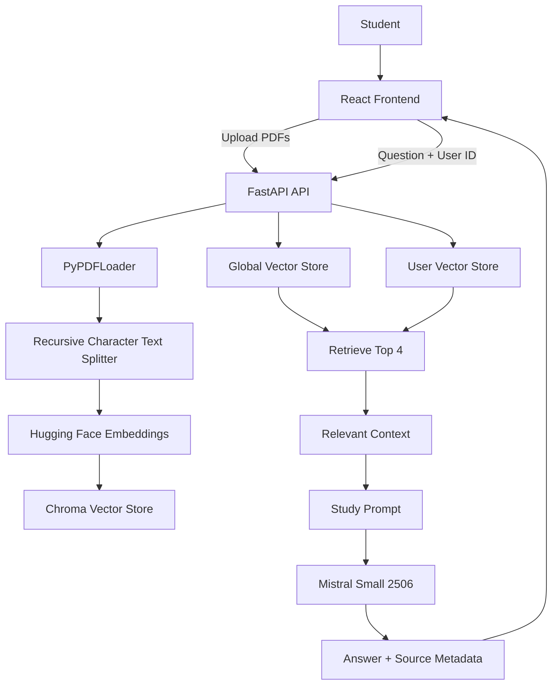

# Smart Study — RAG Study Assistant

> **Ask your material. Understand it.**  
> A RAG-powered study assistant that lets you upload study PDFs, retrieve relevant context with semantic search, and get grounded answers with source-page references.

[](https://react.dev/)
[](https://vite.dev/)
[](https://fastapi.tiangolo.com/)
[](https://www.langchain.com/)
[](https://mistral.ai/)
[](https://www.trychroma.com/)

---

## Preview

<p align="center">
  
</p>

Smart Study is built around a simple idea: **your study material should be the source of truth**. Instead of asking an LLM to answer from general knowledge, the application retrieves relevant passages from indexed PDFs and supplies that context to the model before generating an answer.

---

## Features

###  Study Material Management

- Upload one or multiple PDF files.
- Store uploaded material inside a user-specific workspace.
- Automatically process uploaded PDFs for retrieval.
- Keep a lightweight recent-files list in the browser.
- Show indexed documents directly in the study library.

###  Retrieval-Augmented Generation

- Extract text from PDFs with `PyPDFLoader`.
- Split documents with `RecursiveCharacterTextSplitter`.
- Generate embeddings using `sentence-transformers/all-MiniLM-L6-v2`.
- Store document chunks in Chroma vector stores.
- Retrieve the most relevant chunks for each question.
- Search both default study material and the user's uploaded material.
- Pass retrieved context to Mistral Small before generating the answer.
- Preserve source filename and page metadata for answer references.

###  Study Chat

- Ask natural-language questions about your study material.
- Receive Markdown-formatted explanations.
- Get source filename and page references with assistant responses.
- Handle empty/no-material states gracefully.
- Use quick prompts for common study actions such as explanations, examples, and summaries.

---

## How It Works

```text
PDF Upload
    ↓
PyPDFLoader
    ↓
Recursive Character Text Splitter
    ↓
Hugging Face Embeddings
    ↓
Chroma Vector Store
    ↓
User Question
    ↓
Similarity Retrieval (top 4)
    ↓
Relevant Context
    ↓
Mistral Small 2506
    ↓
Grounded Answer + Sources
```

The application follows a standard RAG pipeline. Uploaded PDFs are parsed into documents, split into overlapping chunks, embedded into vectors, and stored in Chroma. When a user asks a question, the backend retrieves the four most relevant chunks from the available vector stores and provides them as context to the LLM.

The prompt explicitly instructs the model to answer **only from the supplied context** and to say when the study material does not contain enough information.

---

## RAG Architecture



### Why chunking?

Large documents are split into smaller overlapping chunks so retrieval can focus on relevant portions of a document rather than passing an entire PDF to the model.

### Why embeddings?

Embeddings convert text into numerical representations that allow semantically related passages to be found even when the wording of the question and document is different.

### Why Chroma?

Chroma provides the vector-store layer used to persist document embeddings and perform similarity-based retrieval for both default and user-specific study material.

### How retrieval works

For every question, the backend queries the available vector stores with a retriever configured for `k=4`. Relevant chunks are combined into a context block before the LLM is called.

### How context reaches the LLM

The retrieved text is inserted into a dedicated system prompt together with the user's question. The model is instructed to use only that supplied context when answering.

### How sources are preserved

`PyPDFLoader` provides source and page metadata. The backend extracts the PDF filename and converts the zero-based page index into a human-readable page number before returning source references to the frontend.

---

## Tech Stack

| Layer | Technology | Purpose |
|---|---|---|
| Frontend | React 19 | Study interface and chat experience |
| Routing | React Router | Study, Files, and About pages |
| Build Tool | Vite | Frontend development and production builds |
| Backend | FastAPI | API layer and RAG orchestration |
| RAG Framework | LangChain | Document loading, prompting, embeddings and vector-store integration |
| PDF Processing | PyPDF | Extract text and page metadata from PDFs |
| Text Splitting | RecursiveCharacterTextSplitter | Create overlapping retrieval chunks |
| Embeddings | `sentence-transformers/all-MiniLM-L6-v2` | Convert document/question text into embeddings |
| Vector Store | Chroma | Store and retrieve embedded document chunks |
| LLM | Mistral Small 2506 | Generate context-grounded study answers |
| Frontend Markdown | react-markdown | Render structured assistant responses |

---

## Screenshots

### Study Library

<p align="center">
  
</p>

The Files page provides a simple workspace for uploading multiple PDFs and viewing recently added material.

### RAG Pipeline

<p align="center">
  
</p>

The About page explains the four-stage flow used by the application: **Upload → Index → Retrieve → Answer**.

---

## Project Structure

```text
Smart-Study-Assistant-RAG-BASED-/
├── main.py
├── app.py
├── requirement.txt
├── src/
│   ├── embeddings/
│   │   └── embeddings_model.py
│   └── splitters/
│       └── text_splitter.py
│
├── frontend/
│   └── rag-frontend/
│       ├── src/
│       │   ├── components/
│       │   │   ├── AppShell.jsx
│       │   │   ├── ChatMessage.jsx
│       │   │   └── FileUploader.jsx
│       │   ├── pages/
│       │   │   ├── StudyPage.jsx
│       │   │   ├── FilePage.jsx
│       │   │   └── AboutPage.jsx
│       │   ├── services/
│       │   │   └── api.js
│       │   ├── App.jsx
│       │   └── App.css
│       ├── package.json
│       └── vite.config.js
│
├── docs/
│   └── screenshots/
│       ├── study-library.png
│       └── about-rag.png
│
└── README.md
```

### Backend

`main.py` contains the FastAPI application, document ingestion, vector-store initialization, retrieval logic, prompt construction, LLM invocation, and source extraction.

`src/embeddings/` contains the Hugging Face embedding configuration.

`src/splitters/` contains the document chunking configuration.

### Frontend

The React application is split into reusable components, page-level views, and a small API service layer. The frontend currently contains Study, Files, and About pages.

---

## Getting Started

### Prerequisites

- Python 3.10+
- Node.js and npm
- A Mistral API key

### 1. Clone the repository

```bash
git clone https://github.com/MustbeSarthak/Smart-Study-Assistant-RAG-BASED-PROJECT.git
cd Smart-Study-Assistant-RAG-BASED-
```

### 2. Set up the backend

Create and activate a virtual environment:

```bash
python -m venv .venv
```

Windows:

```bash
.venv\Scripts\activate
```

macOS / Linux:

```bash
source .venv/bin/activate
```

Install the Python dependencies:

```bash
pip install -r requirement.txt
```

### 3. Set up the frontend

```bash
cd frontend/rag-frontend
npm install
```

---

## Environment Variables

Create a `.env` file in the project root:

```env
MISTRAL_API_KEY=your_mistral_api_key
```

The application loads environment variables with `python-dotenv`.

> **Never commit `.env` files or API keys to Git.**

---

## Running Locally

### Start the FastAPI backend

From the project root:

```bash
uvicorn main:app --reload
```

The API will be available at:

```text
http://localhost:8000
```

### Start the React frontend

From `frontend/rag-frontend`:

```bash
npm run dev
```

Vite will print the local frontend URL in the terminal.

### Frontend API configuration

The frontend uses `VITE_API_URL` when provided and otherwise defaults to:

```text
http://localhost:8000
```

For a custom backend URL, create a frontend `.env` file:

```env
VITE_API_URL=http://localhost:8000
```

---

## API Overview

### `POST /upload`

Uploads one or more PDF files for a user and indexes their content into that user's Chroma vector store.

**Query parameter**

```text
user_id=<user-id>
```

**Request**

`multipart/form-data` with one or more `files` fields.

**Response**

Returns the uploaded filenames and the number of chunks added to the vector store.

---

### `POST /ask`

Retrieves relevant context and generates a grounded answer.

**Request**

```json
{
  "question": "Explain the main concept of this topic.",
  "user_id": "user-example"
}
```

**Response**

```json
{
  "answer": "Generated answer...",
  "sources": [
    {
      "file": "example.pdf",
      "page": 3
    }
  ]
}
```

The response includes the generated answer together with deduplicated source filename/page references.

---

## Engineering Highlights

### User-specific retrieval

Uploaded PDFs are stored under a user-specific workspace and indexed into a dedicated Chroma directory. This allows retrieval to include the user's own material without mixing it into another user's vector store.

### Global + personal knowledge sources

Each question can retrieve context from both:

- Default documents stored in the application's data directory.
- PDFs uploaded to the current user's workspace.

### Metadata-aware source references

The application retains PDF source and page metadata throughout document loading and retrieval, allowing the frontend to show where an answer's context came from.

### Controlled generation

The LLM is given an explicit system instruction to answer only from retrieved context. If the material does not contain enough information, the assistant is instructed to say so rather than invent an answer.

### Separation of concerns

The React frontend handles the study experience and API communication, while FastAPI owns document processing, retrieval, prompt construction, and model interaction.

---

## Limitations

- Chat messages are currently stored only in the active browser session and are not persisted to a database.
- The application currently uses a locally generated browser `user_id` rather than a full authentication system.
- Uploaded PDFs and vector stores are stored on the backend filesystem.
- Retrieval currently uses a straightforward top-4 similarity search without a dedicated reranking stage.
- The current implementation is designed as a focused study assistant rather than a production-scale multi-tenant platform.

---

## Future Improvements

- [ ] Persistent conversation history
- [ ] User authentication and account management
- [ ] Streaming LLM responses
- [ ] Retrieval evaluation and improved ranking/reranking
- [ ] Support for additional document formats
- [ ] Cloud/object storage for uploaded documents
- [ ] Production deployment and scalable vector-store infrastructure
- [ ] Conversation management and searchable chat history

---

## Author

**Sarthak Sharma**

[GitHub](https://github.com/MustbeSarthak) · [LinkedIn](https://www.linkedin.com/in/sharthak-sharma-73a403368/)

---

## Repository

[View Smart Study on GitHub](https://github.com/MustbeSarthak/Smart-Study-Assistant-RAG-BASED-PROJECT)
